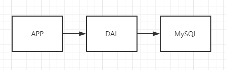
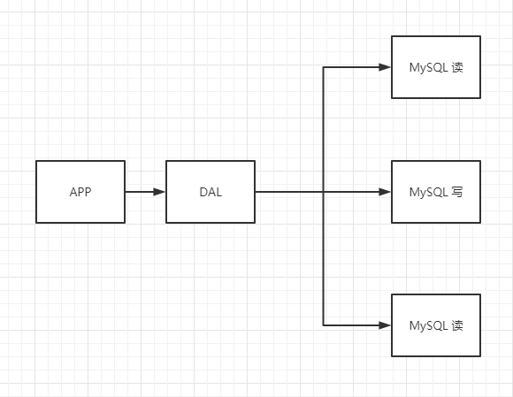
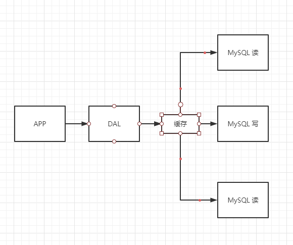
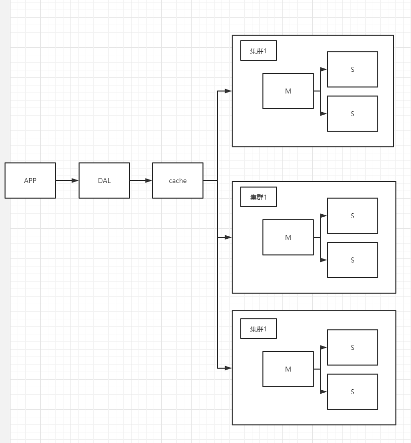

# Nosql概述

## 为什么要用Nosql

我们现在处于大数据时代，很多数据之间都有很多关联和联系。

大数据：一般数据库无法分析处理。

2006年，Hadoop数据库诞生。目前入门都是SpringBoot + SpringCloud。

1. 单机Mysql时代

​		那个时候访问量不会很大，单个数据库完全足够，很多页面都是静态的，服务器根本没压力。

​		那个时代的问题就是数据量会不会太大，本机资源是否足够

2. 缓存时代Memcahced + Mysql + 垂直拆分

   

   网站大部分情况都在读数据库，为了减轻数据库压力，就会用缓存

​		先是优化了Mysql的结构和索引 > 文件缓存（IO） > Memcached（当时最热门的技术）

3. 分库分表+垂直拆分+水平拆分

   

   本质：数据库（读、写）

   早些年MyISAM：表锁，在高并发下就不行

   转战Innodb：行锁，效率提升了一些

   慢慢就通过分库分表来解决写的压力，Mysql在哪个年代推出了表分区。

4. 如今

   技术爆炸的年代，十年时间。

   （定位信息，热榜等）

   比如我们看一篇文章，他的阅读量真的是看一次加一次吗，他其实是写在缓存，过一段时间再持久化。

   比如Mysql存储比较大的文件、博客、图片，导致数据库很大，效率就很低。研究如何设计专门的数据库去存储这些数据。

   再者，在巨大的数据量的前提下，我们想添加一个行，那怎么办呢。

5. 为什么要使用NOsql了

   用户信息，社交网络，地理位置，用户数据，用户日志量巨大

   这个时候使用NOSQL数据库，NOSQL数据库可以很好地处理以上情况。

## 什么是NoSQL

Nosql（Not only sql）泛指非关系型数据库。尤其是超大规模的高并发的社区。

这些数据类型不需要固定格式（行列），不需要多余的操作就可以横向、纵向扩展。

类比`Map<String, Object>`以键值对的方式存储数据。

###  特点

1. 方便扩展（数据之间没有关系）

2. 大数据量高性能（Redis一秒写8万次，读11万次，细粒度）

3. 数据库不需要设计，随取随用。

4. RDBMS和NoSql的区别

   传统：结构化、Sql语句、数据的关系都在单独的表种、数据类型定义、严格的一致性...

   Nosql：非结构化、没用固定的查询语言、键值对存储、CPA定理和BASE、高性能

