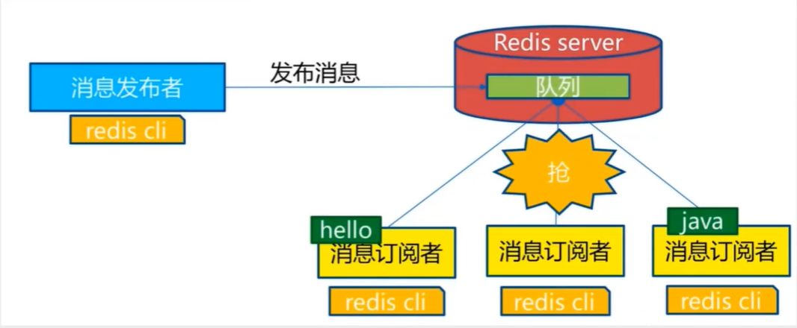
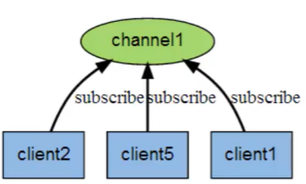
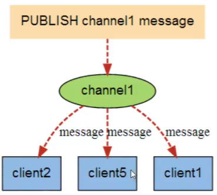
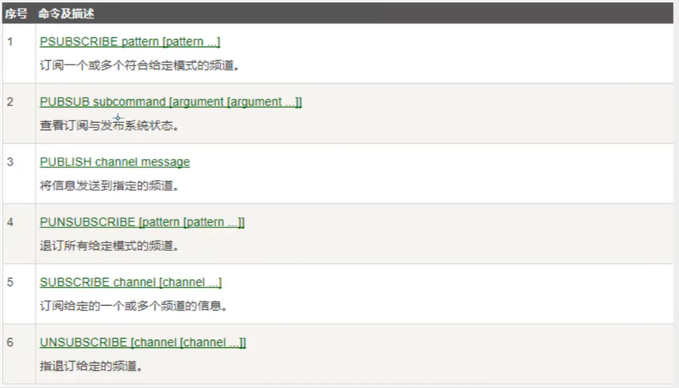

# Redis发布订阅

## 发布订阅模型

通信-队列-发布者-管道-接收者

Redis发布订阅（pub/sub）是一种消息通信模式：发送者（pub）发送消息，订阅者（sub）接收消息。例如：微信、微博等。

redis客户端可以订阅任意数量的频道。

订阅、发布消息图

关键：消息发送者、频道、消息接收者



下面展示了频道channel1以及订阅频道的三个客户端的关系



当有新消息发布的时候，就会发布给三个客户端



这些命令被广泛用于构建即时通信应用，比如网络聊天室、实时广播、时时提醒等。



## 测试

在bash1中订阅masijun频道

```sh
# bash1
127.0.0.1:6379> subscribe masijun
Reading messages... (press Ctrl-C to quit)
1) "subscribe"
2) "masijun"
3) (integer) 1
```

在bash2中向masijun频道发送消息

```sh
# bahs2
127.0.0.1:6379> publish masijun hello,world
(integer) 1
```

在bash1中得到消息

```sh
# bash1
127.0.0.1:6379> subscribe masijun
Reading messages... (press Ctrl-C to quit)
1) "subscribe"
2) "masijun"
3) (integer) 1
1) "message"        # 得到消息
2) "masijun"        # 得到消息
3) "hello,world"    # 得到消息 
```

## 原理

可以看一下他用c写的源码

底层其实是用字典来维护频道，键就是频道，值是个链表，类似哈希？

## 应用

使用场景：

1. 聊天室
2. 推送订阅
3. 实时消息系统

再复杂的情况，就会使用MQ来做