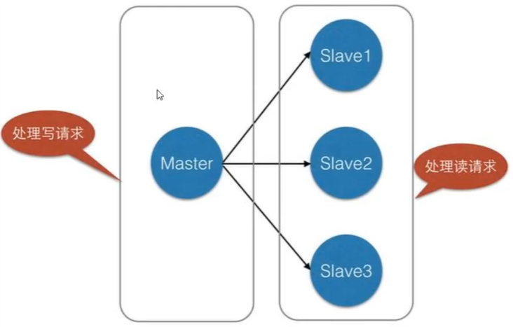
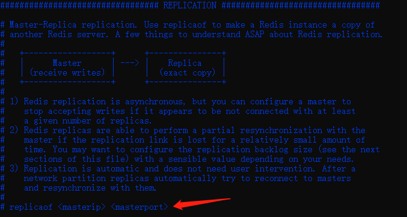
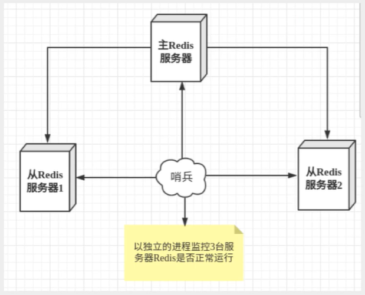
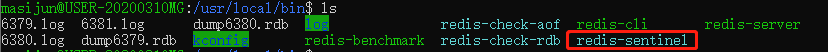
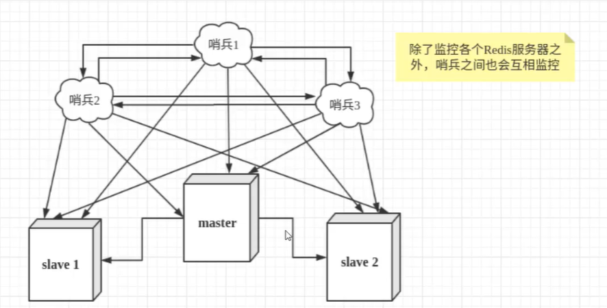

# Redis主从复制

## 概念

主从复制，是指将一台Redis服务器的数据，复制到其他的Redis服务器。前者称为主角点（master/leader），后者称为从节点（slave/follower）；数据的复制是单向的，**只能由主节点到从节点**。master以写为主，slave以读为主。

**默认情况下，每个Redis都是主节点**

一个主节点可以有多个从节点，但是一个从节点只能有一个主节点。

主从复制的作用主要包括：

1. 数据冗余
2. 故障恢复
3. 负载均衡
4. 高可用的基石

一般来说，在工程中只使用一台Redis是万万不能的，原因如下：

1. 从结构上，单个Redis在工程中发生单点故障且一台服务器的压力较大
2. 从容量上，单个Redis的服务器容量有限，一般来说单台Redis的容量不超过20G

一般情况下，是多读少写的。

主从复制的架构。



主从复制、读写分离！为了解决读的问题，80%情况下都是读操作。可以减缓服务器压力。架构中常用，最低配是一主二从。

只要是在公司中，是一定要开启主从复制的（集群）。

## 环境

查看当前Redis的信息

```sh
127.0.0.1:6379> info replication
# Replication
role:master # 角色
connected_slaves:0 # 从机数量
master_failover_state:no-failover
master_replid:b36c0873e961fe8383c5fe03af8ae1eb87f30d1d # 随机id
master_replid2:0000000000000000000000000000000000000000
master_repl_offset:0
second_repl_offset:-1
repl_backlog_active:0
repl_backlog_size:1048576
repl_backlog_first_byte_offset:0
repl_backlog_histlen:0
```

复制三个配置文件，修改信息

1. 端口号
2. PID
3. log文件名
4. RDB文件名

开启服务器，查看进程，有三个了

```sh
masijun@USER-20200310MG:/usr/local/bin$ ps -ef|grep redis
masijun    378     1  0 23:27 ?        00:00:00 redis-server 127.0.0.1:6379
masijun    385     1  0 23:27 ?        00:00:00 redis-server 127.0.0.1:6380
masijun    392     1  0 23:27 ?        00:00:00 redis-server 127.0.0.1:6381
masijun    407    83  0 23:28 tty2     00:00:00 grep --color=auto redis
```

## 一主二从

默认情况下都是主机，一般情况下只配置从机即可。

即“认老大”，一主（79），二从（80，81）

```sh
# 配置从机
127.0.0.1:6380> slaveof 127.0.0.1 6379
OK
127.0.0.1:6380> info replication
# Replication
role:slave
master_host:127.0.0.1
master_port:6379
master_link_status:up
master_last_io_seconds_ago:1
master_sync_in_progress:0
slave_repl_offset:14
slave_priority:100
slave_read_only:1
replica_announced:1
connected_slaves:0
master_failover_state:no-failover
master_replid:6d9b67eb8e11b91ef26d4a09c31fc536aff04ee8
master_replid2:0000000000000000000000000000000000000000
master_repl_offset:14
second_repl_offset:-1
repl_backlog_active:1
repl_backlog_size:1048576
repl_backlog_first_byte_offset:1
repl_backlog_histlen:14
# 查看主机信息
127.0.0.1:6379> info replication
# Replication
role:master
connected_slaves:2
slave0:ip=127.0.0.1,port=6380,state=online,offset=70,lag=1
slave1:ip=127.0.0.1,port=6381,state=online,offset=70,lag=0
master_failover_state:no-failover
master_replid:6d9b67eb8e11b91ef26d4a09c31fc536aff04ee8
master_replid2:0000000000000000000000000000000000000000
master_repl_offset:70
second_repl_offset:-1
repl_backlog_active:1
repl_backlog_size:1048576
repl_backlog_first_byte_offset:1
repl_backlog_histlen:70
```

真实的主从配置都是在配置文件中写死，命令都是一次性的。



> 细节1
>
> 1. 主机才能写，从机不能写
> 2. 主机中的所有信息数据，都会自动被从机保存。

```sh
127.0.0.1:6379> set k1 v1
OK
127.0.0.1:6380> get k1
"v1"
127.0.0.1:6380> set k2 v2
(error) READONLY You can't write against a read only replica.
```

> 细节2
>
> 主机断了拿不到之前写的数据（除非持久化了）

> 细节3
>
> 从机断电后，再次恢复从机状态会立马再主机中获取值（全量复制）

> Slave启动成功连接到master后会发送一个sync同步命令
>
> Master接收到命令，启动后台的存盘进程，同时手机接收到的命令，并将整个数据文件传到slave完成一次完全同步
>
> **全量复制**：slave服务在接收到数据库文件后，将其存盘并加载到内存中
>
> 增量复制：master继续将新的收集到的命令一次传给slave，完成同步
>
> 只要是**重新**连接master，一次性**完全同步**（全量复制）将会被自动执行，我们的数据一定可以在从机中看到。

## 层层链路

我们让6379为6380的主机，6380为6381的主机。

查看信息

```sh
127.0.0.1:6379> info replication
# Replication
role:master
connected_slaves:2
slave0:ip=127.0.0.1,port=6380,state=online,offset=682,lag=0
slave1:ip=127.0.0.1,port=6381,state=online,offset=682,lag=0
master_failover_state:no-failover
master_replid:40bd2cac74bc5ecc614d0f10904de7300e885b0a
master_replid2:0000000000000000000000000000000000000000
master_repl_offset:682
second_repl_offset:-1
repl_backlog_active:1
repl_backlog_size:1048576
repl_backlog_first_byte_offset:1
repl_backlog_histlen:682
# 6380
127.0.0.1:6380> info replication
# Replication
role:slave
master_host:127.0.0.1
master_port:6379
master_link_status:up
master_last_io_seconds_ago:8
master_sync_in_progress:0
slave_repl_offset:724
slave_priority:100
slave_read_only:1
replica_announced:1
connected_slaves:1
slave0:ip=127.0.0.1,port=6381,state=online,offset=724,lag=1
master_failover_state:no-failover
master_replid:40bd2cac74bc5ecc614d0f10904de7300e885b0a
master_replid2:0000000000000000000000000000000000000000
master_repl_offset:724
second_repl_offset:-1
repl_backlog_active:1
repl_backlog_size:1048576
repl_backlog_first_byte_offset:1
repl_backlog_histlen:724
# 6381
127.0.0.1:6381> info replication
# Replication
role:slave
master_host:127.0.0.1
master_port:6380
master_link_status:up
master_last_io_seconds_ago:7
master_sync_in_progress:0
slave_repl_offset:710
slave_priority:100
slave_read_only:1
replica_announced:1
connected_slaves:0
master_failover_state:no-failover
master_replid:40bd2cac74bc5ecc614d0f10904de7300e885b0a
master_replid2:0000000000000000000000000000000000000000
master_repl_offset:710
second_repl_offset:-1
repl_backlog_active:1
repl_backlog_size:1048576
repl_backlog_first_byte_offset:1
repl_backlog_histlen:710
```

此时的80依旧是从节点（无法写入）

> 如果6379断开了，能不能自己选择主节点呢？

通过手动`slaveof no one`将其更改为主节点。如果这个时候6379连线，也不行

## 哨兵模式

自动选取主节点的模式

自动监控主机是否故障，如果故障了根据投票自动将从库转换为主库

哨兵模式是一种特殊的模式，首先Redis提供了哨兵的命令，烧饼是一个独立的进程，作为进程，他会独立运行。其原理是哨兵通过发送命令，等待Redis服务器响应，从而监控运行的多个Redis实例。





哨兵的两个作用：

1. 通过发送命令，查看redis服务器运行状态
2. 检测到master宕机后，会自动将slave切换为master，然后通过**发布订阅模式**通知从服务器，修改配置文件，让他们切换主机

然而一个哨兵也会出现问题，一般是多哨兵监控，哨兵间也会互相监控，模型如下



用文字描述一下**故障切换（failover）**的过程。假设主服务器宕机，哨兵1先检测到这个结果，系统并不会马上进行failover过程，仅仅是哨兵1主观的认为主服务器不可用，这个现象成为**主观下线**。当后面的哨兵也检测到主服务器不可用，并且数量达到一定值时，那么哨兵之间就会进行一次投票，投票的结果由一个哨兵发起，进行failover操作。切换成功后，就会通过发布订阅模式，让各个哨兵把自己监控的从服务器实现切换主机，这个过程称为**客观下线**。这样对于客户端而言，一切都是透明的。

### 测试

1. 配置哨兵sentinel.conf，最核心的配置

    ```sh
    # sentinel monitpr 被监控的名 host port 1
    sentinel monitor myredis 127.0.0.1 6379 1
    ```

2. 启动哨兵

   ```sh
   masijun@USER-20200310MG:/usr/local/bin$ sudo redis-sentinel kconfig/sentinel.conf
   461:X 15 Jun 2021 00:03:23.311 # oO0OoO0OoO0Oo Redis is starting oO0OoO0OoO0Oo
   461:X 15 Jun 2021 00:03:23.311 # Redis version=6.2.4, bits=64, commit=00000000, modified=0, pid=461, just started
   461:X 15 Jun 2021 00:03:23.312 # Configuration loaded
   461:X 15 Jun 2021 00:03:23.314 * Increased maximum number of open files to 10032 (it was originally set to 1024).
   461:X 15 Jun 2021 00:03:23.317 * monotonic clock: POSIX clock_gettime
                   _._
              _.-``__ ''-._
         _.-``    `.  `_.  ''-._           Redis 6.2.4 (00000000/0) 64 bit
     .-`` .-```.  ```//    _.,_ ''-._
    (    '      ,       .-`  | `,    )     Running in sentinel mode
    |`-._`-...-` __...-.``-._|'` _.-'|     Port: 26379
    |    `-._   `._    /     _.-'    |     PID: 461
     `-._    `-._  `-./  _.-'    _.-'
    |`-._`-._    `-.__.-'    _.-'_.-'|
    |    `-._`-._        _.-'_.-'    |           https://redis.io
     `-._    `-._`-.__.-'_.-'    _.-'
    |`-._`-._    `-.__.-'    _.-'_.-'|
    |    `-._`-._        _.-'_.-'    |
     `-._    `-._`-.__.-'_.-'    _.-'
         `-._    `-.__.-'    _.-'
             `-._        _.-'
                 `-.__.-'
   
   461:X 15 Jun 2021 00:03:23.331 # WARNING: The TCP backlog setting of 511 cannot be enforced because /proc/sys/net/core/somaxconn is set to the lower value of 128.
   461:X 15 Jun 2021 00:03:23.350 # Sentinel ID is d9b586bd6f6e268315d781cc0a24fa7fe9f6775f
   461:X 15 Jun 2021 00:03:23.350 # +monitor master myredis 127.0.0.1 6379 quorum 1
   461:X 15 Jun 2021 00:03:23.353 * +slave slave 127.0.0.1:6380 127.0.0.1 6380 @ myredis 127.0.0.1 6379

3. 关闭6379的主机，哨兵弹出信息

   ```sh
   461:X 15 Jun 2021 00:07:12.200 # +sdown master myredis 127.0.0.1 6379
   461:X 15 Jun 2021 00:07:21.817 # +odown master myredis 127.0.0.1 6379 #quorum 1/1
   461:X 15 Jun 2021 00:07:21.817 # +new-epoch 1
   461:X 15 Jun 2021 00:07:21.817 # +try-failover master myredis 127.0.0.1 6379
   461:X 15 Jun 2021 00:07:21.835 # +vote-for-leader d9b586bd6f6e268315d781cc0a24fa7fe9f6775f 1
   461:X 15 Jun 2021 00:07:21.836 # +elected-leader master myredis 127.0.0.1 6379
   461:X 15 Jun 2021 00:07:21.836 # +failover-state-select-slave master myredis 127.0.0.1 6379
   461:X 15 Jun 2021 00:07:21.894 # +tilt #tilt mode entered
   461:X 15 Jun 2021 00:07:51.964 # -tilt #tilt mode exited
   461:X 15 Jun 2021 00:08:13.769 # -failover-abort-no-good-slave master myredis 127.0.0.1 6379
   461:X 15 Jun 2021 00:08:13.836 # +tilt #tilt mode entered
   461:X 15 Jun 2021 00:08:43.841 # -tilt #tilt mode exited
   461:X 15 Jun 2021 00:08:43.841 # Next failover delay: I will not start a failover before Tue Jun 15 00:13:21 2021
   ```

   很明确了，会在某一时间点选举新的主机。

4. 再次连接老主机，会给新主机当从机。

### 优点：

1. 哨兵集群，基于主从复制模式，所有的主从配置优点他都有
2. 主从可以切换，故障可以转移，系统可用性提高
3. 哨兵模式就是主从模式的升级，手动到自动，更健壮

### 缺点：

1. Redis不方便在线扩容，集群容量一旦达到上限，扩容很麻烦
2. 实现哨兵模式的配置其实是很麻烦的，里面有很多选择

### 哨兵的所有配置：

一般由运维来配置

```sh
# Example sentinel.conf
 
# 哨兵sentinel实例运行的端口 默认26379
port 26379
 
# 哨兵sentinel的工作目录
dir /tmp
 
# 哨兵sentinel监控的redis主节点的 ip port 
# master-name  可以自己命名的主节点名字 只能由字母A-z、数字0-9 、这三个字符".-_"组成。
# quorum 当这些quorum个数sentinel哨兵认为master主节点失联 那么这时 客观上认为主节点失联了
# sentinel monitor <master-name> <ip> <redis-port> <quorum>
  sentinel monitor mymaster 127.0.0.1 6379 2
 
# 当在Redis实例中开启了requirepass foobared 授权密码 这样所有连接Redis实例的客户端都要提供密码
# 设置哨兵sentinel 连接主从的密码 注意必须为主从设置一样的验证密码
# sentinel auth-pass <master-name> <password>
sentinel auth-pass mymaster MySUPER--secret-0123passw0rd
 
 
# 指定多少毫秒之后 主节点没有应答哨兵sentinel 此时 哨兵主观上认为主节点下线 默认30秒
# sentinel down-after-milliseconds <master-name> <milliseconds>
sentinel down-after-milliseconds mymaster 30000
 
# 这个配置项指定了在发生failover主备切换时最多可以有多少个slave同时对新的master进行 同步，
这个数字越小，完成failover所需的时间就越长，
但是如果这个数字越大，就意味着越 多的slave因为replication而不可用。
可以通过将这个值设为 1 来保证每次只有一个slave 处于不能处理命令请求的状态。
# sentinel parallel-syncs <master-name> <numslaves>
sentinel parallel-syncs mymaster 1
 
 
 
# 故障转移的超时时间 failover-timeout 可以用在以下这些方面： 
#1. 同一个sentinel对同一个master两次failover之间的间隔时间。
#2. 当一个slave从一个错误的master那里同步数据开始计算时间。直到slave被纠正为向正确的master那里同步数据时。
#3.当想要取消一个正在进行的failover所需要的时间。  
#4.当进行failover时，配置所有slaves指向新的master所需的最大时间。不过，即使过了这个超时，slaves依然会被正确配置为指向master，但是就不按parallel-syncs所配置的规则来了
# 默认三分钟
# sentinel failover-timeout <master-name> <milliseconds>
sentinel failover-timeout mymaster 180000
 
# SCRIPTS EXECUTION
 
#配置当某一事件发生时所需要执行的脚本，可以通过脚本来通知管理员，例如当系统运行不正常时发邮件通知相关人员。
#对于脚本的运行结果有以下规则：
#若脚本执行后返回1，那么该脚本稍后将会被再次执行，重复次数目前默认为10
#若脚本执行后返回2，或者比2更高的一个返回值，脚本将不会重复执行。
#如果脚本在执行过程中由于收到系统中断信号被终止了，则同返回值为1时的行为相同。
#一个脚本的最大执行时间为60s，如果超过这个时间，脚本将会被一个SIGKILL信号终止，之后重新执行。
 
#通知型脚本:当sentinel有任何警告级别的事件发生时（比如说redis实例的主观失效和客观失效等等），将会去调用这个脚本，
这时这个脚本应该通过邮件，SMS等方式去通知系统管理员关于系统不正常运行的信息。调用该脚本时，将传给脚本两个参数，
一个是事件的类型，
一个是事件的描述。
如果sentinel.conf配置文件中配置了这个脚本路径，那么必须保证这个脚本存在于这个路径，并且是可执行的，否则sentinel无法正常启动成功。
#通知脚本
# sentinel notification-script <master-name> <script-path>
  sentinel notification-script mymaster /var/redis/notify.sh
 
# 客户端重新配置主节点参数脚本
# 当一个master由于failover而发生改变时，这个脚本将会被调用，通知相关的客户端关于master地址已经发生改变的信息。
# 以下参数将会在调用脚本时传给脚本:
# <master-name> <role> <state> <from-ip> <from-port> <to-ip> <to-port>
# 目前<state>总是“failover”,
# <role>是“leader”或者“observer”中的一个。 
# 参数 from-ip, from-port, to-ip, to-port是用来和旧的master和新的master(即旧的slave)通信的
# 这个脚本应该是通用的，能被多次调用，不是针对性的。
# sentinel client-reconfig-script <master-name> <script-path>
 sentinel client-reconfig-script mymaster /var/redis/reconfig.sh
```


