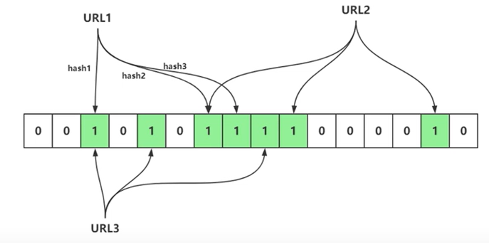
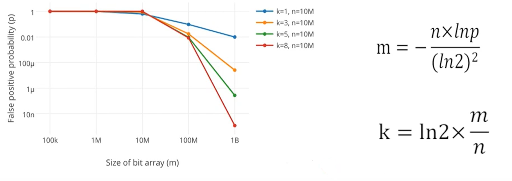

# 布隆过滤器

## （一）目前有10亿个数，乱序且不重复，我们需要对其进行排序。限制条件: 32位机器、2G内存

如果HashMap解决，1000w个key = String（<16字符）value = Integer，占用1.2G/400M。其实空间利用率很低。

在少量数据的情况下HashMap可以使用，但是在大量情况下，就不好了。

## （二）如何在亿级黑名单中快速定位URL地址是否在黑名单

## （三）布隆过滤器

Bloom Filter是一个二进制向量数据结构，他有很好的空间和时间效率，被用来检测一个元素是不是某个集合中的内容。

基本思想: 做哈希。

布隆过滤器出了一个位数组，还有k个哈希函数。当一个元素加入布隆过滤器中的时候，会进行如下操作:
* 使用k个哈希函数对元素值进行k次计算，得到k个哈希值。
* 根据得到的哈希值，在位数组中把对应下标的值置位1.

当我们判断是否存在的时候，也是做k次，同时判断k个哈希位置是否是1，如果有一个为0，那就是不存在。

思考如下问题:

1. 为什么进行多次哈希计算？

        
   
2. 布隆过滤器有什么问题？

   
3. 哈希函数是不是越多越好？
   
    不是，反而可能更不好。
   
   k就是多少个哈希函数，m是位数组大小，n是数据量，p就是错误率。
   
   这就是设计布隆过滤器的公式。

## （四）位图

布隆过滤器依赖于位图实现，我们可以用Redis的一个基本数据结构Bitmap来实现。

## （五）手写实现BloomFilter

[参考代码](../06-BloomFiter/src/main/java/com/example/bloomfilter/redisbase/RedisBloomFilter.java)

## （六）Redisson包自带的BloomFilter

这个没什么好说的，就是自带的。

## （七）Google的BloomFilter

谷歌的只能单机使用，不能用Redis，仅此而已。

## （八）优缺点

优点:
1. 增加和查询元素的时间复杂度为：O(K), (K为哈希函数的个数，一般比较小)，与数据量大小无关
2. 哈希函数相互之间没有关系，方便硬件并行运算
3. 布隆过滤器不需要存储元素本身，在某些对保密要求比较严格的场合有很大优势
4. 在能够承受一定的误判时，布隆过滤器比其他数据结构有这很大的空间优势
5. 数据量很大时，布隆过滤器可以表示全集，其他数据结构不能
6. 使用同一组散列函数的布隆过滤器可以进行交、并、差运算

缺点:
1. 有误判率，即存在假阳性(False Position)，即不能准确判断元素是否在集合中（补救方法：再建立一个白名单，存储可能会误判的数据）
2. 不能获取元素本身
3. 一般情况下不能从布隆过滤器中删除元素
4. 如果采用计数方式删除，可能会存在计数回绕问题

## （九）场景

1. 黑名单
2. 访问记录
3. 防爬虫过滤
4. 大数据检查是否存在某元素