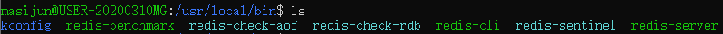

# Redis入门

## 概述

 **Re**mote **Di**ctionary **S**erver(Redis) ，即远程字典服务，是一个开源的使用ANSI [C语言](https://baike.baidu.com/item/C语言)编写、支持网络、可基于内存亦可持久化的日志型、Key-Value[数据库](https://baike.baidu.com/item/数据库/103728)，并提供多种语言的API。从2010年3月15日起，Redis的开发工作由VMware主持。从2013年5月开始，Redis的开发由[Pivotal](https://baike.baidu.com/item/Pivotal)赞助。

redis会周期性的把更新的数据写入磁盘或者把修改操作写入追加的记录文件，并且在此基础上实现了master-slave(主从)同步。

当下最热门的NoSql技术之一！被人们称为结构化数据库。

## Redis能干嘛

1. 内存存储，持久化，内存是断电即失去的，所以持久化很重要（RDB、AOF）
2. 效率高，可以用于高速缓存
3. 发布订阅虚脱
4. 地图信息分析
5. 计数器、计时器（浏览量，自增自减）

## Redis特性

1. 开源免费
2. 提供多种数据类型
3. 多种语言的接口
4. 持久化
5. 集群
6. 事务

## Redis学习的文档

1. 公众号
2. 官网：https://redis.io/
3. 中文网：https://www.redis.cn/
4. github：https://github.com/redis/redis

官方已经不建议用Windows进行Redis开发了

本笔记都是基于Linux的，使用的是Win10 ubuntu LTS和docker

## 安装

### windows

在github下载安装包https://github.com/redis/redis/releases

解压即完成


双击server即可开启redis服务


信息包含了端口、PID等信息

### LInux

版本：ubuntu 20.04.2 LTS

1. 下载安装包

   

2. 将文件移到/opt下 `mv red*.gz /opt`
3. 解压缩 `tar -zxvf red*`
4. 得到redis


5. 进入解压缩后的文件，可以看到redis的配置文件


6. 下载g++
7. 执行make 和 make install命令（因为redis是c写的）
8. 我们打开 /usr/local/bin就能看到我们安装的redis
9. 新建kconfig目录，拷贝/opt/redis.config文件
10. 配置redis为本地启动


​	将deamonize改为yes

11. 启动redis`redis-server kconfig/redis.conf`


12. 测试、查看进程是否开启 `redis-cli -p 6379` `ps -ef|grep reids`


## 性能测试

使用benchmark



```sh
# 测试100个并发，100,000请求
redis-benchmark -h localhost -p 6379 -c 100 -n 100000
```

## 基础知识

### 数据库变化

查看config，我们会看到


默认使用0数据库，我们可以通过`SELECT <dbid>`来选择数据库

```sh
127.0.0.1:6379[3]> select 0
OK
127.0.0.1:6379> dbsize
(integer) 0
```

## Redis是单线程的

Redis是很快的，基于内存操作的，CPU不是Redis的性能瓶颈，Redis是依靠机器的内存和网络情况的。所以就是单线程。

为什么Redis单线程还这么快？

Redis是基于C语言写的，Qps是10w+，这个不比Memcache性能差

1. 误区1：高性能服务器都是多线程的
2. 误区2：多线程（CPU会上下文切换）一定比单线程效率高

因为Redis的数据直接存放在内存，所以用多线程就会在上下文切换消耗资源，单线程效率就会更高。

## Redis端口号是女明星的名字


